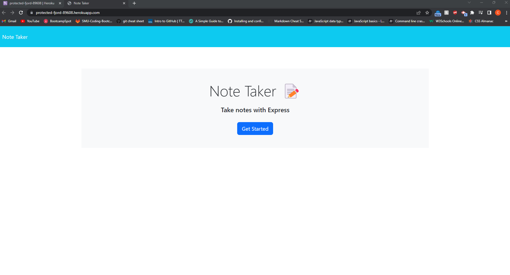

# Note Taker

#### By Carson Loser

#### This application is designed for a user to create a new note, delete existing notes, and manage all notes.

# Prerequisites and Dependencies

* When the app is opened, the user is presented with a button that takes them to the "create notes" page

* When the notes page button is clicked, a list of existing notes displays on the the left hand side of the window.

* There should be empty fields that prompt the user to enter a new note title and text for that given note.

* When both fields have been filled out correctly, a save icon should display.

* When the user clicks the display button, the note they just filled out should display with the existing notes list on the left side of the window.

* When the user clicks on an existing note, that note will display on the right side of the window.

* When the user clicks on the write icon, a new empty note prompt is displayed where the user can start the process over.

# Heroku Link

- https://protected-fjord-89608.herokuapp.com/

# Heroku Deployed App 

- The following image demonstrates the web application's appearance

